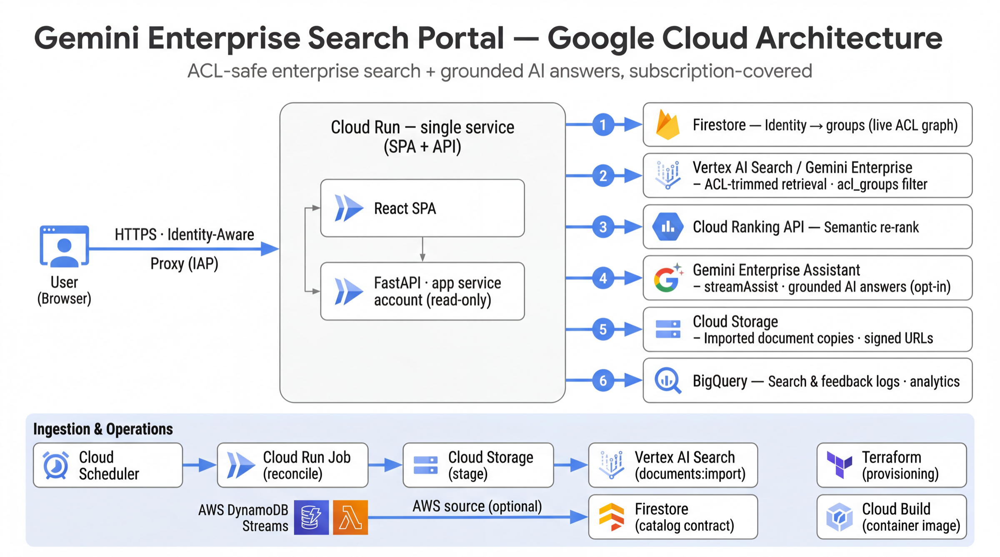

# GE Search Portal

A brandable, custom web front-end over a **Gemini Enterprise / Vertex AI Search (VAIS)**
data store, with **per-user security trimming at query time** via an external Firestore
permission graph. Built generically so it works for any account (demo persona shows Amgen).

> The whole point: the **same query returns different results and answers per user**,
> trimmed to what each user is allowed to see — without per-document Google ACLs or WIF.

> **Note:** Independent reference implementation / demo. Sample branding and data sources
> (Amgen, Alphabet, DeepMind, Google Health) are public and used for illustration only — no
> affiliation or endorsement is implied. Licensed under **Apache-2.0** (see [`LICENSE`](./LICENSE)).

**Docs:** [`DEPLOY.md`](./DEPLOY.md) — **turnkey one-command deploy** · [`PLAN.md`](./PLAN.md) —
full design rationale · [`INGEST.md`](./INGEST.md) — initial-load + **incremental** ingest
(Firestore catalog → VAIS, DynamoDB-ready) · [`frontend/DESIGN.md`](./frontend/DESIGN.md) — UI.

## Features
- 🔍 **VAIS retrieval** over a data store's serving config (no separate GE *app* needed),
  with query expansion and spell correction (recency boosting available but off by default) — then an optional **semantic
  re-rank** (Discovery Engine **Ranking API**) over the ACL-trimmed set *before* results
  and the AI answer, so the best docs lead.
- 🔒 **Security trimming, server-side & scalable** — each doc's authorized groups are indexed
  in VAIS as `acl_groups`; every query filters `acl_groups: ANY(<user's live Firestore
  groups>)`, so the trim + faceting happen in VAIS over the whole corpus (no sampling). A
  live Firestore re-check of the returned page is the defense-in-depth net.
- 🎚️ **Dynamic, cascading data filters** — facet chips (company, source, type, year, …)
  computed server-side; selecting one narrows the others (exclude-own-field multi-select).
- 🧠 **Opt-in AI answer — Gemini Enterprise engine, subscription-covered** — search is
  LLM-free/fast by default; a header toggle + on-demand button generate a grounded, cited
  answer (`/api/answer`). Every answer is produced by the **Gemini Enterprise engine assistant**
  (`:streamAssist` — query understanding, retrieval, grounded generation, inline citations),
  scoped by the user's indexed `acl_groups` (+ facet) predicate so the ACL trim holds
  (`id` is **not** a filterable field on a GE engine — see *Identity & access*). The same path powers
  **per-document Q&A / summarize** (`/api/doc/qa`) and **"Ask about these documents"** follow-up
  Q&A over the result set (`/api/ask`).
- 💳 **All traffic billed through the GE subscription** — both `:search` and the assistant
  (`:streamAssist`) are called on the **GE engine's** serving config, so queries draw on the
  pooled per-seat Gemini Enterprise subscription instead of standalone Vertex AI Search charges
  (SKU `93D6-7280-CF05`). Querying the data store directly would bill standalone — so the app
  never does.
- 📄 **Signed-URL access to the imported copy** (`/api/doc/{id}`) — ACL-checked, alongside
  the original web link.
- 🔁 **Initial + incremental ingestion** — a Firestore `catalog` collection is the on-ramp;
  an idempotent **reconcile** Cloud Run Job (Cloud Scheduler) syncs only the delta into VAIS.
  DynamoDB-ready (see [`INGEST.md`](./INGEST.md)).
- 📈 **Analytics & autotuning** — searches/feedback/ingestion logged to BigQuery; user
  events fed to VAIS for learn-to-rank.
- 🎨 **Amgen-branded UI** (React + Tailwind) — hero landing + results, persona switcher.
- ☁️ **One-command deploy** — Terraform (infra) + Cloud Build (image) + Cloud Run Jobs
  (ingest + reconcile), **IAP on by default**.

## Architecture



> **Request flow (1–6):** the browser reaches the Cloud Run service through **IAP**; FastAPI (read-only app SA) resolves the caller's **groups in Firestore**, runs an **ACL-trimmed** query against **Vertex AI Search / Gemini Enterprise** (`acl_groups` filter), **re-ranks** the trimmed set, and — on opt-in — grounds an AI answer via **`streamAssist`**. Document access is a signed URL to the imported **Cloud Storage** copy; searches and feedback land in **BigQuery**. Ingestion & ops (Scheduler → reconcile Job → import; optional AWS DynamoDB source; Terraform + Cloud Build) run alongside.

Cleanly separated planes: **Terraform = infra**, **Cloud Build = image/deploy**,
**Cloud Run Jobs = ingestion** (bulk `ge-search-ingest` + scheduled incremental
`ge-search-reconcile`).

### Diagrams
Branded SVGs in [`frontend/public/diagrams/`](./frontend/public/diagrams/) (also rendered
in-app under **"How it works"**):

| Diagram | What it shows |
|---|---|
| [`arch-search.svg`](./frontend/public/diagrams/arch-search.svg) | Core search — ACL-safe, query-time flow |
| [`arch-ai.svg`](./frontend/public/diagrams/arch-ai.svg) | AI answers — GE engine assistant (:streamAssist), opt-in, grounded, ACL-safe, subscription-covered |
| [`arch-billing.svg`](./frontend/public/diagrams/arch-billing.svg) | Licensing & billing — how the per-seat GE subscription covers search + Q&A (and what would bill extra) |
| [`arch-pricing.svg`](./frontend/public/diagrams/arch-pricing.svg) | Pricing model — what a per-user/month seat includes vs. what bills separately (reranker, hosting) |
| [`arch-ingest.svg`](./frontend/public/diagrams/arch-ingest.svg) | Catalog & document-processing pipeline (layout parser → chunking → index; initial + incremental) |
| [`arch-aws-sync.svg`](./frontend/public/diagrams/arch-aws-sync.svg) | Syncing with AWS DynamoDB via the Firestore catalog contract |
| [`arch-logging.svg`](./frontend/public/diagrams/arch-logging.svg) | Logging, analytics & feedback (BigQuery + learn-to-rank loop) |
| [`arch-exports.svg`](./frontend/public/diagrams/arch-exports.svg) | Optional BigQuery exports — billing (per-SKU cost) + Cloud Logging (troubleshooting), flag-gated |

## Security model (the core)
- **RBAC, dynamic, enforced server-side, not user-controllable.** A user sees a document iff
  some group has an edge in **both** Firestore `group_users` (group↔user) and
  `document_groups` (doc↔group). The doc→group side is mirrored into the VAIS index as
  `acl_groups`; queries filter `acl_groups: ANY(<user groups>)`, so VAIS returns and
  facet-counts **only** permitted docs — scalable to any corpus size. The user→group side
  stays **live** in Firestore (resolved per request), so membership changes take effect
  immediately with no re-index. `backend/main._retrieve_trim` then re-verifies the returned
  page against live Firestore (`permissions.trim`) as defense-in-depth, so a stale
  `acl_groups` can never leak.
- **Answer is ACL-safe.** `/api/answer`, `/api/ask`, and `/api/doc/qa` re-derive the user's
  authorization server-side and scope the GE engine assistant (`:streamAssist`) via
  `toolsSpec.vertexAiSearchSpec.filter` with the **same indexed `acl_groups: ANY(<user groups>)`
  (+ facet) predicate the search trim uses** — verified enforced (grounding refuses to cross it).
  Two designs that look right but **don't** work on a GE engine (verified live, July 2026):
  `id: ANY(<allowed ids>)` — `id` isn't a filterable field (`:search` rejects it; the assistant
  tool silently returns no grounding) — and `dataStoreSpecs[].filter`, which is only honored on
  multi-data-store engines (silently **ignored** on a single-store engine — a leak if relied on).
  `discovery.assist()` therefore fails closed when no ACL filter is supplied.
- **Data filters only narrow within the permitted set** — facets are computed over the
  ACL-filtered set, so chips never reveal hidden docs; cascading uses exclude-own-field.
- **Imported-copy access is ACL-checked.** `/api/doc/{id}` verifies the user's groups before
  minting a short-lived V4 **signed URL** (keyless signing: app SA holds
  `iam.serviceAccountTokenCreator` on itself + IAM SignBlob).
- **Identity:** IAP in prod (`X-Goog-Authenticated-User-Email`); a demo persona switcher
  (`X-Demo-User`) for unauthenticated showcases.
- **Least privilege:** **app SA** is read-only (`discoveryengine.viewer`, `datastore.user`,
  `aiplatform.user`, `storage.objectViewer`, `bigquery.dataEditor`, a narrow custom role for
  `userEvents.create` + `rankingConfigs.rank`, + `tokenCreator` on itself for signing); the **ingest SA** (also used
  by reconcile) has write (`discoveryengine.editor`, `storage.objectAdmin`, `datastore.user`,
  `bigquery.dataEditor`); a **scheduler SA** only has `run.invoker` on the reconcile job.

### Identity & access — two independent layers
Easy to conflate; they are separate controls:

1. **Who can REACH the site** — the IAP allow-list, Terraform `var.iap_members`
   (`user:…`, `group:…`, or `domain:…`). *The demo grants `domain:google.com`* so any
   Googler can open it; a real deployment would scope this to a group.
2. **Whose identity FILTERS the data** (RBAC) — `IDENTITY_SOURCE` (Terraform `identity_source`):
   - **`demo`** (default) — trust the **persona switcher** header (`X-Demo-User`), so a
     visitor can act as any seeded persona (David / Nick / Ravi). **Demos only** — the
     client chooses the identity, so it must never gate real data.
   - **`iap`** — trust the **IAP-signed** `X-Goog-Authenticated-User-Email`; each signed-in
     user filters **their own** data via their Firestore `group_users`. The persona switcher
     / `X-Demo-User` / `?u=` are **ignored** (see `backend/identity.py`).

   **Real deployment:** set `identity_source = "iap"` and seed real users into `group_users`
   (a user with no membership sees nothing — fail-closed). In `iap` mode the persona switcher
   is inert; `/api/config.identitySource` tells the UI which mode it's in so it can hide it.

## Repository layout
```
ge-search-portal/
├── PLAN.md                 # full design (security, corpus, ingestion, multimodal, …)
├── INGEST.md               # initial + incremental ingest (catalog → reconcile), DynamoDB-ready
├── README.md               # this file
├── deploy-all.sh           # infra → build → data orchestrator
├── cloudbuild.yaml         # build image → AR → deploy service + both jobs
├── Dockerfile              # node build (SPA) → python runtime (API + jobs)
├── terraform/              # APIs, GCS, Firestore, VAIS, SAs/IAM, Cloud Run svc+jobs, scheduler.tf, BigQuery
├── backend/                # FastAPI: core(pure) · discovery(VAIS, search_faceted) · permissions(Firestore) ·
│                           #          generate(Gemini) · gcsdoc(signed URLs) · identity · bqlog · main · config
├── frontend/               # React + Vite + Tailwind (see frontend/DESIGN.md)
├── scripts/                # bulk:  01 fetch · 02 metadata · 03 stage+import · 04 ACL seed · ingest_entrypoint.sh
│                           # acl:   fix_schema · sync_metadata · force_reindex  (server-side acl_groups)
│                           # incr.: catalog_model · catalog · catalog_source · loader · replicate_catalog ·
│                           #        reconcile · catalog_status · add_document · gen_demo_catalog · _common · ingestlog
├── seed/                   # personas.yaml, acl_rules.yaml, catalog_delta_*.jsonl, demo_docs/
└── tests/                  # pytest (no live GCP needed): test_core · test_discovery · test_reconcile
```

## Quick start (one command)
Needs **Editor+** on a GCP project, plus `terraform` + `gcloud`.
```bash
bash deploy-all.sh YOUR_PROJECT_ID            # or: deploy-all.sh PID us-central1 --steps infra,build,data
```
- **infra** — `terraform apply`: APIs, GCS bucket, Firestore (Native), VAIS data store
  (layout parsing/chunking), SAs + IAM, Artifact Registry, Cloud Run **service (IAP on)** +
  **ingest Job**, BigQuery log tables.
- **build** — Cloud Build → image → updates service & job.
- **data** — runs the `ge-search-ingest` Job: corpus → GCS → `documents:import` → Firestore
  ACLs → declare/sync `acl_groups`. (Import is async; results populate a few minutes later.)

After the initial load, **adding documents is a Firestore `catalog` write** — the
`ge-search-reconcile` Cloud Run Job (Cloud Scheduler, `var.reconcile_schedule`) loads the
delta into VAIS idempotently. See [`INGEST.md`](./INGEST.md) for the catalog contract, the
`add_document.py` on-ramp, and the DynamoDB (Streams-Lambda / boto3) integration.

IAP access: if you don't create `terraform/terraform.tfvars`, `deploy-all.sh` auto-grants the
**deploying gcloud user** so you can open the site immediately; to open it to a team/domain,
copy `terraform.tfvars.example` → `terraform.tfvars` and set `iap_members`. Full prerequisites,
hand-off zip, and gotchas: **[`DEPLOY.md`](./DEPLOY.md)**. Teardown: `cd terraform && terraform destroy`.

## API
| Method · Path | Purpose |
|---|---|
| `GET /healthz` | liveness |
| `GET /api/me` | resolved user + groups |
| `GET /api/config` | data store id, identity source, personas, facet fields |
| `POST /api/search` | `{query, facets?}` → `{results[], citations[], availableFilters, …}` — GE-engine `:search`, ACL-trimmed, **LLM-free** (fast) |
| `POST /api/answer` | `{query, facets?}` → `{summary, citations[]}` — opt-in answer via the GE engine assistant (`:streamAssist`), ACL+facet-scoped (the keyword query is wrapped in a summarize ask — the assistant skips bare keywords as `NON_ASSIST_SEEKING_QUERY_IGNORED`) |
| `POST /api/ask` | `{query, facets?, question}` → `{answer, citations[]}` — GE-engine-assistant Q&A, ACL+facet-scoped |
| `POST /api/doc/qa` | `{documentId, question}` → `{answer}` — GE-engine-assistant Q&A / summarize, ACL-checked + ACL-scoped, steered to the doc by title (`id` isn't filterable, so exact single-doc pinning isn't possible server-side) |
| `GET /api/doc/{id}` | 302 → short-lived **signed URL** for the imported GCS copy (ACL-checked; friendly HTML on deny/missing) |
| `POST /api/feedback` | `{documentId, query, vote}` → logs to BigQuery + (up-vote) VAIS user event |

## Ranking & relevance
1. **Native GE-engine ranking** (`:search` on the **GE engine** serving config) — hybrid
   semantic + keyword retrieval, with `queryExpansion: AUTO` and `spellCorrection: AUTO`. This is
   the primary ranking and is covered by the GE subscription; it's strong on its own. An **optional**
   recency `boostSpec` (`BOOST_RECENT_YEARS`, **off by default**) is available for corpora with a
   wide date range — leave it off unless recency is a genuine tie-breaker, since a blanket year
   boost on an all-recent corpus perturbs the native relevance order rather than improving it.
2. **Learn-to-rank autotuning** (over time) — `search` + up-vote `view-item` user events are
   reported to VAIS (`discovery.write_user_event`), so the native ranking improves with use.
3. **Optional cross-encoder re-rank — Discovery Engine Ranking API** (`rankingConfigs:rank`,
   `backend/discovery.py::rerank`). A documented capability that sharpens ordering by scoring each
   doc against the *full query*. **Off by default (`RERANK=off`)** because it's a **separately
   billed** Vertex AI Search call (not routed through the GE engine) — turning it on means an extra
   charge outside the subscription. When on, it overfetches `RERANK_TOP_N` and feeds the
   cross-encoder VAIS **extractive segments** (`RERANK_EXTRACTIVE`) rather than short snippets.
   **Enabling it later** is a runtime env flip on the Cloud Run service (no rebuild) — see
   [DEPLOY.md → "Optional: sharper ranking via the Ranking API"](./DEPLOY.md) for the exact
   command and the opex trade-off.

**Interpreting the scores.** Relevance scores are in `[0,1]` and are meant for **relative
ordering**, not as a calibrated `0.5` threshold. Strict ranking reserves high scores for near-exact
matches, so most genuinely-useful context lands in the lower band (often `0–0.5`) — expected, not a
defect. Use **rank order**, not an absolute cutoff — calibrate any threshold on your own corpus.

**Docs:** [Ranking API guide](https://docs.cloud.google.com/generative-ai-app-builder/docs/ranking)
· [`rankingConfigs.rank` REST reference](https://docs.cloud.google.com/generative-ai-app-builder/docs/reference/rest/v1/projects.locations.rankingConfigs/rank)
· [models & token limits](https://docs.cloud.google.com/generative-ai-app-builder/docs/ranking#rank-models)

## Document processing, ingestion & scale (see PLAN.md §5.5–5.7)
- **Layout parser + layout chunking** (`terraform/vais.tf`) → structure + tables + OCR; VAIS
  embeds chunks into a hybrid semantic+keyword index.
- **Grounding is text-based.** The GE engine assistant grounds on the indexed text/extractive
  segments produced by the layout parser (tables/headings/OCR), not vision over raw PDF page
  images. (True page-image multimodal would require a **direct** Vertex Gemini call, which bills
  **separately per token** outside the GE subscription — so it's intentionally not used here, to
  keep all traffic covered. See [DEPLOY.md](./DEPLOY.md) for the billing rationale.)
- **Scale-out** — `ingest_task_count` / `ingest_parallelism` (Terraform). The corpus is
  sharded disjointly (`items[i::n]`) across Cloud Run Job tasks; each task imports its own
  `metadata-<task>.jsonl` (INCREMENTAL, idempotent — no barrier).
- **Per-document ledger** — `ge_search_logs.ingestion_log` records each doc through
  `download → staged → import → acl` (status + errors), keeping the efficient bulk import.

## Demo corpus & personas
Two domains → two group roles (`seed/personas.yaml`):

| Group | Demo user | Documents |
|---|---|---|
| `finance`  | dana.finance@example.com | Alphabet earnings + Amgen annual/quarterly financials |
| `research` | riley.research@example.com       | DeepMind + Google Health publications (full-text PDFs) |

### Corpus sources (all download real full-text PDFs)
| Group | Source | Sub-source | Download route | Status |
|---|---|---|---|---|
| `research` | DeepMind | `deepmind` | publications crawl → **arXiv** PDF | ✅ |
| `research` | Google Health | `google-health` | static index → **arXiv** PDF (+ themes) | ✅ |
| `research` | Amgen R&D | `amgen-research` | PubMed Central → **Europe PMC** `?pdf=render` | ✅ |
| `research` | Google journals (opt-in) | `gdm-pmc` / `health-pmc` / `google-pmc` | PMC → Europe PMC, by affiliation | ✅ |
| `finance` | Alphabet filings | `alphabet` | **SEC EDGAR** 10-K/10-Q (+ 8-K via `EDGAR_FORMS`) HTML | ✅ |
| `finance` | Amgen filings | `amgen` | **SEC EDGAR** 10-K/10-Q (+ 8-K via `EDGAR_FORMS`) HTML | ✅ |

**PDF download note.** NCBI's PDF host gates the blob behind an anti-bot interstitial; the
reliable route is `https://europepmc.org/articles/PMC<id>?pdf=render` (OA only), falling back
through `citation_pdf_url` → NCBI OA pdf/tgz. arXiv works everywhere. Broader coverage
(bioRxiv/medRxiv/CORE/Unpaywall): see `openags/paper-search-mcp`.

## Configuration
**App env** (`backend/config.py`): `PROJECT_ID`, `PROJECT_NUMBER`, `LOCATION`,
`DATA_STORE_ID`, `ENGINE_ID` (the **GE engine** — all `:search`/`:streamAssist` hit its serving
config so traffic is subscription-covered), `ASSISTANT_ID` (default `default_assistant`),
`IDENTITY_SOURCE` (iap|demo), `PERMISSION_BACKEND=firestore`, `FIRESTORE_DATABASE`,
`SIGNED_URL_MINUTES`, `BQ_LOGGING`, `BQ_DATASET`, `PAGE_SIZE`, `OVERFETCH`, `BOOST_RECENT_YEARS`,
`RERANK` (off by default — separately-billed Ranking API), `RERANK_MODEL`, `RERANK_TOP_N`,
`RERANK_EXTRACTIVE` (on|off; extractive segments for result display).
**Ingest/catalog env** (`scripts/`): `CATALOG_SOURCE` (demo|manifest|dynamo|firestore),
`CATALOG_DELTA`, `GCS_BUCKET`, `EDGAR_FORMS`, `DYNAMO_TABLE` + `DYNAMO_*_ATTR`.
**Terraform vars** (`terraform/variables.tf`): `project_id`, `region`, `location`,
`firestore_location`, `bq_location`, `data_store_id`, `engine_id` (GE engine/app),
`assistant_id`, `identity_source`, `iap_members`, `ingest_limit`,
`ingest_task_count`, `ingest_parallelism`, `reconcile_schedule`.

## Logging & analytics (BigQuery `ge_search_logs`)
- `searches` — `event_time, search_id, user, query, groups[], filters, result_count, result_doc_ids[]`
- `ai_turns` — `event_time, search_id, user, groups[], feature (answer|ask|doc_qa), query, question, document_id, model_requested, model_used, used_search, result_count, latency_ms`
- `feedback` — `event_time, search_id, user, query, document_id, title, vote`
- `ingestion_log` — `event_time, task, source, document_id, stage, status, bytes, error`

`search_id` is a correlation key minted by `/api/search` and echoed by every AI turn +
feedback, so you can join an answer/ask/Q&A (and the model that ran) back to the search that
produced the result set — e.g. AI-usage rate per search, model mix, latency, web-search use.

**Ready-to-run queries:** [`sql/analytics.sql`](./sql/analytics.sql) — AI-usage funnel,
model mix + failover rate, **web-search adoption**, latency p50/p95 by feature+model,
search→AI-follow-up correlation, usage by persona/group, feedback funnel, top AI-driving
queries, and ingestion health. Run with:
```bash
bq query --use_legacy_sql=false --project_id=YOUR_PROJECT "$(sed -n '/^-- 3)/,/;/p' sql/analytics.sql)"
# or paste any single query from the file. NOTE: back-tick reserved words: `user`, `groups`, `rows`.
```

## Discovery Engine showcase & evals
Run directly against the deployed data store with your own ADC (no IAP needed):
```bash
export PROJECT_ID=… LOCATION=global DATA_STORE_ID=ge-search-demo FIRESTORE_DATABASE='(default)'

# showcase: query → ranked results + AI summary
python3 scripts/de_search.py "What were Alphabet's quarterly revenue and operating income?"
python3 scripts/de_search.py "How does AlphaFold predict protein structure?" --n 5
python3 scripts/de_search.py "earnings" --filter 'company: ANY("alphabet")'

# eval: retrieval relevance + per-persona security trim (mirrors the backend; CI-usable exit code)
python3 scripts/de_eval.py
```
`de_eval.py` asserts (A) domain queries return that department's docs, and (B) each
persona's ACL-trimmed result set contains **only** their domain (no cross-domain leak) —
validated live against VAIS + Firestore.

## Local development & tests
```bash
# unit tests (no live GCP; pure logic, parsers, request shapes, ACL trim, catalog delta)
pip install pytest && python3 -m pytest          # 37 tests

# backend locally (needs ADC + a data store): uv run uvicorn main:app --port 8080  (in backend/)
# frontend dev:  cd frontend && npm install && npm run dev   (proxies /api → :8080)

# manual data pipeline (data store must already exist via terraform):
python3 scripts/01_fetch_corpus.py all --limit 30   # stdlib-only
python3 scripts/02_make_metadata.py
python3 scripts/03_stage_import.py                  # stage to GCS + import
python3 scripts/04_seed_acls.py                     # needs pyyaml + google-cloud-firestore
# or: bash scripts/setup_demo.sh  (runs 1→4; the Cloud Run Job runs the same via ingest_entrypoint.sh)

# incremental ingest (add docs after the initial load) — see INGEST.md:
python3 scripts/add_document.py --json '{"document_id":"x","groups":["finance"],"source_url":"..."}'
python3 scripts/reconcile.py                         # Firestore catalog → VAIS (delta only)
python3 scripts/catalog_status.py                    # loaded vs pending vs failed + drift
```

## Production notes / caveats
- **IAP** is the default; `ALLOW_UNAUTH=1` (legacy `deploy.sh` path) is removed in favor of
  Terraform `iap_enabled`. Org policy may require IAP anyway.
- **Multimodal** + **VS2 / Agent Retrieval** + `gemini-3.5-flash` features: confirm GA /
  region availability for the target org before committing to prod.
- **Finance scrapers** (Alphabet/Amgen IR) are best-effort (JS-rendered pages) — verify on
  first run; research sources are solid.
- The import error-file parsing in `03` is best-effort (defensive id matching); the raw
  `errorConfig` file is always retained in GCS.
